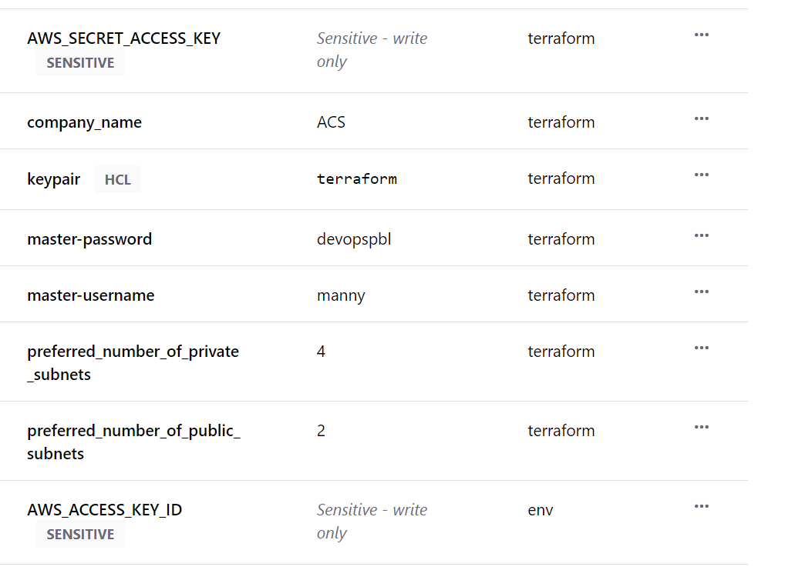
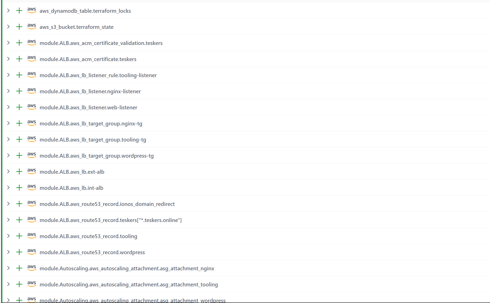

# Terraform-cloud

## Table of Contents
- [Introduction](#introduction)
- [Prerequisites](#prerequisites)
- [Terraform Cloud](#terraform-cloud)
    - [Migrate your Terraform code to Terraform Cloud](#migrate-your-terraform-code-to-terraform-cloud)
- [Building images using Packer](#building-images-using-packer)
- [Run Terraform script](#run-terraform-script)
- [Configure ansible script with Terraform output](#configure-ansible-script-with-terraform-output)
- [Run ansible script](#run-ansible-script)

## Introduction
By now you should have a basic understanding of Terraform and how it works. If not, please read the [Terraform Getting Started Guide](https://www.terraform.io/intro/index.html) first. And be very comfortable with writing HCL code. We would move forward with migrating our infrastructure to Terraform Cloud and also configuring the deployment to work using Ansible, and Packer for building the images.


## Prerequisites
- [Terraform](https://www.terraform.io/downloads.html) is installed on your local machine.
- [Terraform Cloud](https://app.terraform.io/signup/account) account.
- [Previous project code](https://github.com/manny-uncharted/terraform-codes-project-18)


## Terraform Cloud
Terraform Cloud is a managed service that provides you with Terraform CLI to provision infrastructure, either on demand or in response to various events.

By default, Terraform CLI performs operations on the server when it is invoked, it is perfectly fine if you have a dedicated role that can launch it, but if you have a team who works with Terraform – you need a consistent remote environment with remote workflow and shared state to run Terraform commands.

Terraform Cloud executes Terraform commands on disposable virtual machines, this remote execution is also called remote operations.

### Migrate your Terraform code to Terraform Cloud
Let's go through the process of migrating our codes to Terraform Cloud and managing our infrastructure from there.

1. Create a Terraform Cloud account and log in to the dashboard.

2. Create an organization ensure you choose version control as your VCS provider and select GitHub, also select the repository you want to use, the repository should contain your Terraform code and not be empty.

3. Create a workspace, you can create a workspace for each environment you have, for example, you can create a workspace for your development environment, staging environment, and production environment.

4. Configure your variables, you can configure your variables in the workspace settings, you can also configure your variables in the Terraform code, but it is recommended to configure your variables in the workspace settings. Set two environment variables, AWS_ACCESS_KEY_ID and AWS_SECRET_ACCESS_KEY, these variables will be used to authenticate Terraform to AWS.

result:



5. Now it's time to run our Terraform code, but before we do that we need to do the following:
    - Packer to build the AMI
    - Ansible to configure the infrastructure

    Ensure you have Packer and Ansible installed on your local machine, and also ensure you have your AWS credentials configured in your local machine.

    - Packer -[Installation](https://developer.hashicorp.com/packer/tutorials/docker-get-started/get-started-install-cli)
    - Ansible -[Installation](https://docs.ansible.com/ansible/latest/installation_guide/intro_installation.html#pip-install)

Now run plan and apply on the terraform cloud dashboard:

result:



## Building images using Packer
Packer is a tool for creating identical machine images for multiple platforms from a single source configuration. Packer is lightweight, runs on every major operating system, and is highly performant, creating machine images for multiple platforms in parallel. [Here is a guide on how to use Packer](https://developer.hashicorp.com/packer/tutorials/docker-get-started/docker-get-started-provision)

- Create a directory called `ami` in your project folder. This directory will contain the packer configuration files for our ami's.

- Create a file called `bastion.pkr.hcl` in the `ami` directory, this file will contain the configuration for our bastion host.
```hcl
variable "region" {
  type    = string
  default = "us-east-1"
}

locals {
  timestamp = regex_replace(timestamp(), "[- TZ:]", "")
}


# source blocks are generated from your builders; a source can be referenced in
# build blocks. A build block runs provisioners and post-processors on a
# source.
source "amazon-ebs" "terraform-bastion-prj-19" {
  ami_name      = "terraform-bastion-prj-19-${local.timestamp}"
  instance_type = "t2.micro"
  region        = var.region
  source_ami_filter {
    filters = {
      name                = "RHEL-8.2_HVM-20200803-x86_64-0-Hourly2-GP2"
      root-device-type    = "ebs"
      virtualization-type = "hvm"
    }
    most_recent = true
    owners      = ["309956199498"]
  }
  ssh_username = "ec2-user"
  tag {
    key   = "Name"
    value = "terraform-bastion-prj-19"
  }
}

# a build block invokes sources and runs provisioning steps on them.
build {
  sources = ["source.amazon-ebs.terraform-bastion-prj-19"]

  provisioner "shell" {
    script = "bastion.sh"
  }
}
```

- Create a file called `bastion.sh` in the `ami` directory, this file will contain the repositories we need to install on our bastion host.
```bash
# user data for bastion

#!/bin/bash
sudo yum install -y https://dl.fedoraproject.org/pub/epel/epel-release-latest-8.noarch.rpm
sudo yum install -y dnf-utils http://rpms.remirepo.net/enterprise/remi-release-8.rpm 
sudo yum install -y mysql-server wget vim telnet htop git python3 net-tools zip
sudo systemctl start chronyd
sudo systemctl enable chronyd


#installing java 11
sudo yum install -y java-11-openjdk-devel
sudo echo "export JAVA_HOME=$(dirname $(dirname $(readlink $(readlink $(which javac)))))" >> ~/.bash_profile
sudo echo "export PATH=$PATH:$JAVA_HOME/bin" >> ~/.bash_profile
sudo echo "export CLASSPATH=.:$JAVA_HOME/jre/lib:$JAVA_HOME/lib:$JAVA_HOME/lib/tools.jar" >> ~/.bash_profile
source ~/.bash_profile

# clone the Ansible repo
git clone https://github.com/darey-devops/PBL-project-19.git


# install botocore, ansible and awscli
sudo python3 -m pip install boto
sudo python3 -m pip install boto3
sudo python3 -m pip install PyMySQL
sudo python3 -m pip install mysql-connector-python
sudo python3 -m pip install --upgrade setuptools
sudo python3 -m pip install --upgrade pip
sudo python3 -m pip install psycopg2==2.7.5 --ignore-installed
sudo curl "https://awscli.amazonaws.com/awscli-exe-linux-x86_64.zip" -o "awscliv2.zip"
sudo unzip awscliv2.zip
sudo ./aws/install
sudo yum install ansible -y
sudo yum install -y policycoreutils-python-utils
ansible-galaxy collection install amazon.aws
ansible-galaxy collection install community.general
ansible-galaxy collection install community.mysql
ansible-galaxy collection install community.postgresql
```
Note: The `bastion.sh` file contains the repositories we need to install on our bastion host.


- Create a file called `nginx.pkr.hcl` in the `ami` directory, this file will contain the configuration for our  `nginx ami`.
```hcl
variable "region" {
  type    = string
  default = "us-east-1"
}

locals { timestamp = regex_replace(timestamp(), "[- TZ:]", "") }


# source blocks are generated from your builders; a source can be referenced in
# build blocks. A build block runs provisioners and post-processors on a
# source.
source "amazon-ebs" "terraform-nginx-prj-19" {
  ami_name      = "terraform-nginx-prj-19-${local.timestamp}"
  instance_type = "t2.micro"
  region        = var.region
  source_ami_filter {
    filters = {
      name                = "RHEL-8.2_HVM-20200803-x86_64-0-Hourly2-GP2"
      root-device-type    = "ebs"
      virtualization-type = "hvm"
    }
    most_recent = true
    owners      = ["309956199498"]
  }
  ssh_username = "ec2-user"
  tag {
    key   = "Name"
    value = "terraform-nginx-prj-19"
  }
}


# a build block invokes sources and runs provisioning steps on them.
build {
  sources = ["source.amazon-ebs.terraform-nginx-prj-19"]

  provisioner "shell" {
    script = "nginx.sh"
  }
}
```

- Create a file called `nginx.sh` in the `ami` directory, this file will contain the repositories we need to install on our `nginx ami`.
```bash
#!/bin/bash
sudo yum install -y https://dl.fedoraproject.org/pub/epel/epel-release-latest-8.noarch.rpm
sudo yum install -y dnf-utils http://rpms.remirepo.net/enterprise/remi-release-8.rpm 
sudo yum install -y mysql wget vim telnet htop git python3 net-tools 
sudo systemctl start chronyd
sudo systemctl enable chronyd

# selinux config
sudo setsebool -P httpd_can_network_connect=1
sudo setsebool -P httpd_can_network_connect_db=1
sudo setsebool -P httpd_execmem=1
sudo setsebool -P httpd_use_nfs=1


# installing self signed certificate
sudo mkdir /etc/ssl/private

sudo chmod 700 /etc/ssl/private

sudo openssl req -x509 -nodes -days 365 -newkey rsa:2048 -keyout /etc/ssl/private/ACS.key -out /etc/ssl/certs/ACS.crt \
-subj "/C=US/ST=Virginia/L=Northern Virginia/O=mannyuncharted/OU=Dev/CN=$(curl -s http://169.254.169.254/latest/meta-data/local-hostname)"

sudo openssl dhparam -out /etc/ssl/certs/dhparam.pem 2048
```

- Create a file called `ubuntu.pkr.hcl` this would be for our sonarqube ami.
```hcl
variable "region" {
  type    = string
  default = "us-east-1"
}

locals { timestamp = regex_replace(timestamp(), "[- TZ:]", "") }


# source blocks are generated from your builders; a source can be referenced in
# build blocks. A build block runs provisioners and post-processors on a
# source.
source "amazon-ebs" "terraform-ubuntu-prj-19" {
  ami_name      = "terraform-ubuntu-prj-19-${local.timestamp}"
  instance_type = "t2.micro"
  region        = var.region
  source_ami_filter {
    filters = {
      name                = "ubuntu/images/*ubuntu-xenial-16.04-amd64-server-*"
      root-device-type    = "ebs"
      virtualization-type = "hvm"
    }
    most_recent = true
    owners      = ["099720109477"]
  }
  ssh_username = "ubuntu"
  tag {
    key   = "Name"
    value = "terraform-ubuntu-prj-19"
  }
}


# a build block invokes sources and runs provisioning steps on them.
build {
  sources = ["source.amazon-ebs.terraform-ubuntu-prj-19"]

  provisioner "shell" {
    script = "ubuntu.sh"
  }
}
```

- Create a file called `ubuntu.sh` in the `ami` directory, this file will contain the repositories we need to install on our `sonarqube ami`.
```bash
 #!/bin/bash
sudo apt update

sudo apt install -y default-jre

sudo apt install -y default-jdk

sudo apt install -y  git mysql-client wget vim telnet htop python3 chrony net-tools
```

- Create a file called `web.pkr.hcl` in the `ami` directory, this file will contain the configuration for our tooling and wordpress ami.
```hcl
variable "region" {
  type    = string
  default = "us-east-1"
}

locals { timestamp = regex_replace(timestamp(), "[- TZ:]", "") }


# source blocks are generated from your builders; a source can be referenced in
# build blocks. A build block runs provisioners and post-processors on a
# source.
source "amazon-ebs" "terraform-web-prj-19" {
  ami_name      = "terraform-web-prj-19-${local.timestamp}"
  instance_type = "t2.micro"
  region        = var.region
  source_ami_filter {
    filters = {
      name                = "RHEL-8.2_HVM-20200803-x86_64-0-Hourly2-GP2"
      root-device-type    = "ebs"
      virtualization-type = "hvm"
    }
    most_recent = true
    owners      = ["309956199498"]
  }
  ssh_username = "ec2-user"
  tag {
    key   = "Name"
    value = "terraform-web-prj-19"
  }
}


# a build block invokes sources and runs provisioning steps on them.
build {
  sources = ["source.amazon-ebs.terraform-web-prj-19"]

  provisioner "shell" {
    script = "web.sh"
  }
}
```

- Create a file called `web.sh` in the `ami` directory, this file will contain the repositories we need to install on our `tooling and wordpress ami`.
```bash
#!/bin/bash
sudo yum install -y https://dl.fedoraproject.org/pub/epel/epel-release-latest-8.noarch.rpm
sudo yum install -y dnf-utils http://rpms.remirepo.net/enterprise/remi-release-8.rpm
sudo yum install -y mysql wget vim telnet htop git python3 net-tools 
sudo systemctl start chronyd
sudo systemctl enable chronyd
sudo yum module reset php -y
sudo yum module enable php:remi-7.4 -y

# selinux config
sudo setsebool -P httpd_can_network_connect=1
sudo setsebool -P httpd_can_network_connect_db=1
sudo setsebool -P httpd_execmem=1
sudo setsebool -P httpd_use_nfs=1

# installing efs-utils
sudo git clone https://github.com/aws/efs-utils /efs-utils/
cd /efs-utils
sudo yum install -y make
sudo yum install -y rpm-build
sudo make rpm
sudo yum install -y  ./build/amazon-efs-utils*rpm

#installing java 11
sudo yum install -y java-11-openjdk-devel
sudo echo "export JAVA_HOME=$(dirname $(dirname $(readlink $(readlink $(which javac)))))" >> ~/.bash_profile
sudo echo "export PATH=$PATH:$JAVA_HOME/bin" >> ~/.bash_profile
sudo echo "export CLASSPATH=.:$JAVA_HOME/jre/lib:$JAVA_HOME/lib:$JAVA_HOME/lib/tools.jar" >> ~/.bash_profile
source ~/.bash_profile


#installing self signed certificate for apache
sudo yum install -y mod_ssl

sudo openssl req -newkey rsa:2048 -nodes -keyout /etc/pki/tls/private/ACS.key -x509 -days 365 -out /etc/pki/tls/certs/ACS.crt \
-subj "/C=US/ST=Virginia/L=Northern Virginia/O=mannyuncharted/OU=Dev/CN=$(curl -s http://169.254.169.254/latest/meta-data/local-hostname)"


sudo sed -i 's/localhost.crt/ACS.crt/g'  /etc/httpd/conf.d/ssl.conf

sudo sed -i 's/localhost.key/ACS.key/g'  /etc/httpd/conf.d/ssl.conf
```

- Now let's move on to building our ami using the command below.
```bash
packer build bastion.pkr.hcl
packer build nginx.pkr.hcl
packer build ubuntu.pkr.hcl
packer build web.pkr.hcl
```
